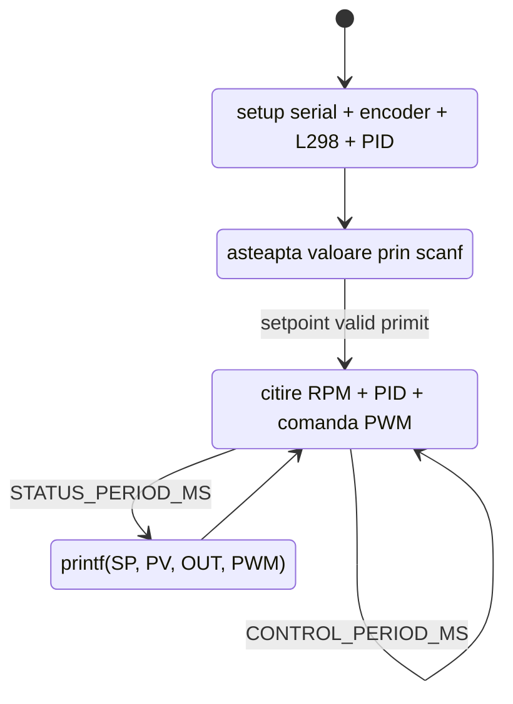
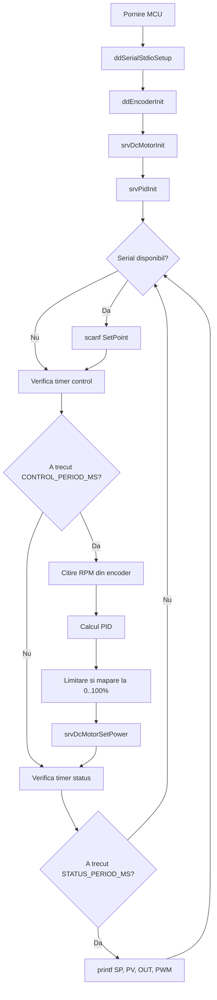
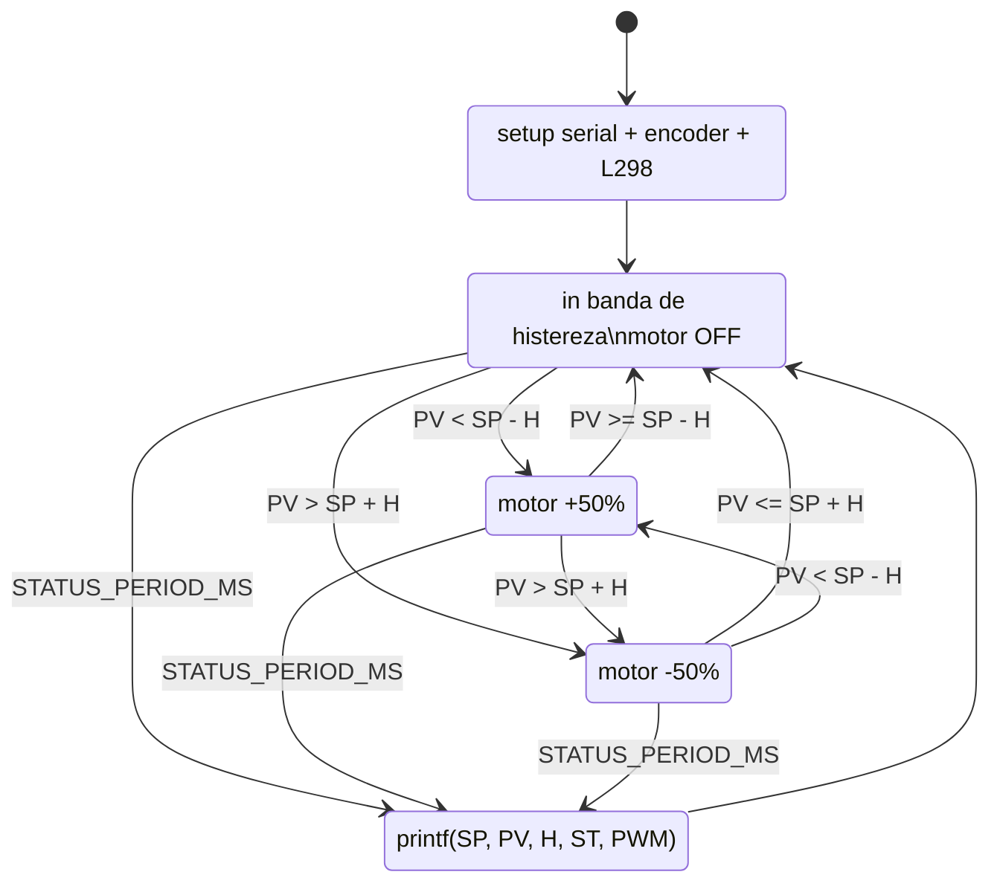
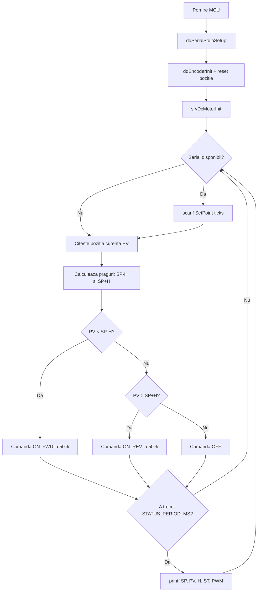

# Diagrame Mermaid - Lab 5

Acest fisier contine cod Mermaid pentru:
- Sarcina 1: control PID turatie motor (`app_lab_5_1`)
- Sarcina 2: control ON-OFF cu histereza pentru pozitie (`app_lab_5_2`)

## Sarcina 1 - PID turatie

### FSM

### FlowChart

## Sarcina 2 - ON-OFF cu histereza (pozitie rotor)

### FSM

### FlowChart

